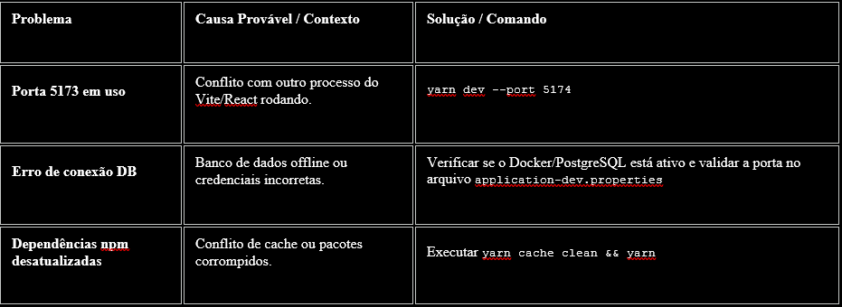

# DSMovie-Monorepo

## Resumo
Este projeto de aplicação web full-stack foi criado a partir de um evento gravado da DevSuperior (2022). A aplicação foi atualizada para versões mais recentes das tecnologias com o auxílio de inteligências artificiais (chatbots), que também foram utilizadas na criação dos casos de uso.
A aplicação permite que os usuários avaliem filmes.

## Observações:
* Foram exercitados os perfis de test e dev
* Apesar de haver a configuração para o perfil prod, desta vez não se chegou a exercitar a implantação da aplicação em nuvem
* O projeto exercitou o conceito de monorepo

## Stack
### Back-end
* Java
* Spring Boot

### Front-end
* React + Vite
* TypeScript
* Bootstrap

### Banco de Dados & Infraestrutura
* H2 (test)
* PostgreSQL + pgAdmin (dev)
* Docker (Ambiente de Banco de Dados)
* Node.js + Yarn (Ambiente de Desenvolvimento)

## Layout (Mobile-first)

### Página de listagem de filmes
`width: 320px - 576px - 992px - 1200px`
<br>

<br>


#### Caso de uso: Listar filmes

<br>

<br>

<br>


### Página com formulário para avaliação de um filme
`width: 320px - 576px - 992px - 1200px`
<br>

<br>


#### Caso de uso: Avaliar filme

<br>

<br>

<br>

<br>

## Instalação e Execução

### Pré-requisitos
Antes de começar, certificar-se de ter instalado:
- Git
- JDK 21 (para o backend)
- Node.js 24.7.0 e Yarn 4.9.4 (para o frontend)
- React 19 + Vite 7+
- PostgreSQL 16 OU Docker Desktop (para o banco de dados)
- Spring Tool Suite (STS) ou outra IDE Java 

### Clonar o Repositório

Opção A - Via Git:
```
git clone git@github.com:Hfictus/DSMovie-Monorepo.git
cd DSMovie-Monorepo
```
Opção B - Download do .zip:
1.	Baixar arquivo .zip do repositório
2.	Extrair a pasta DSMovie-Monorepo <br>
Configurar o Backend <br>
Importar o projeto na IDE (STS) <br>
1.	File → Import → Maven → Existing Maven Projects <br>
2.	Clicar em Browse e localize a pasta backend <br>
3.	Clicar em Selecionar Pasta (Windows) ou Open (Mac/Linux) <br>
4.	Clicar em Finish <br>
Configurar banco de dados (application-dev.properties) <br>
Escolher uma das opções: <br>
Sem Docker (PostgreSQL local na porta 5432): <br>
```
spring.datasource.url=jdbc:postgresql://localhost:5432/dsmovie
```
Certificar-se de que PostgreSQL está instalado e o banco dsmovie foi criado. <br>
Com Docker (PostgreSQL via container na porta 5433): <br>
```
spring.datasource.url=jdbc:postgresql://localhost:5433/dsmovie
```
Certificar-se de que Docker Desktop está rodando.
Executar o backend
No STS, clicar em Run, ou pressionar Ctrl + Shift + F11, ou restart
PgAdmin (gerenciar banco de dados):
•	Sem Docker: http://localhost:5050
•	Com Docker: http://localhost:5051 (credenciais em docker-compose.yml)

Configurar o Frontend
1.	Abrir um terminal na pasta frontend:
```
cd frontend
```
2.	Instalar as dependências:
```
yarn
```
3.	Iniciar o servidor de desenvolvimento:
```
yarn dev
```
4.	Acessar a aplicação no navegador:
```
http://localhost:5173
```
Para parar o servidor: Pressionar Ctrl + C no terminal <br>

Troubleshooting <br>



## Deploy com Docker

### Pré-requisitos
* Docker e Docker Compose instalados
* Git

### Como executar

1. Clonar o repositório:
```
git clone https://github.com/seu-usuario/DSMovie-Monorepo.git
cd DSMovie-Monorepo
```

2. Configurar as variáveis de ambiente:
```
cp .env.example .env
# Edite .env com suas senhas seguras
```

3. Iniciar os containers:
```
docker-compose up -d
```

4. Acesse a aplicação:
- Backend: http://localhost:8080
- PgAdmin: http://localhost:5051

### Segurança

- NUNCA fazer commit do arquivo .env
- Usar senhas fortes e únicas para produção
- Mudar as senhas padrão antes de fazer deploy
- O arquivo .env.example serve apenas como referência

### Estrutura do Projeto

```
├── backend/          # API Spring Boot
├── frontend/         # Frontend (React, Vue, etc)
├── docker-compose.yml
├── .env.example     # Exemplo de variáveis
└── README.md
```
