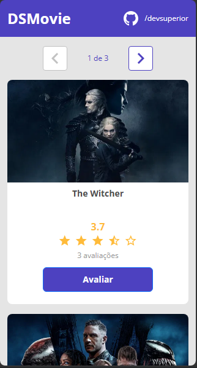
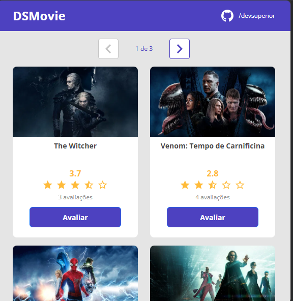
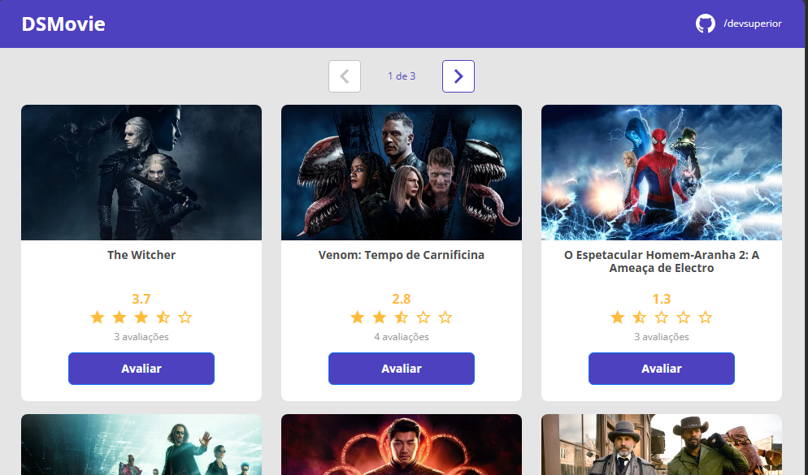
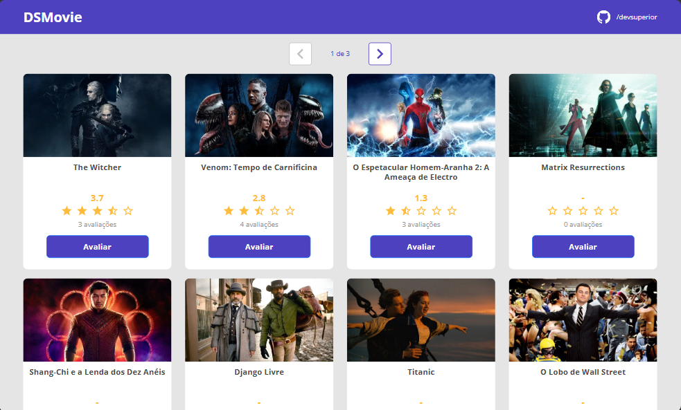
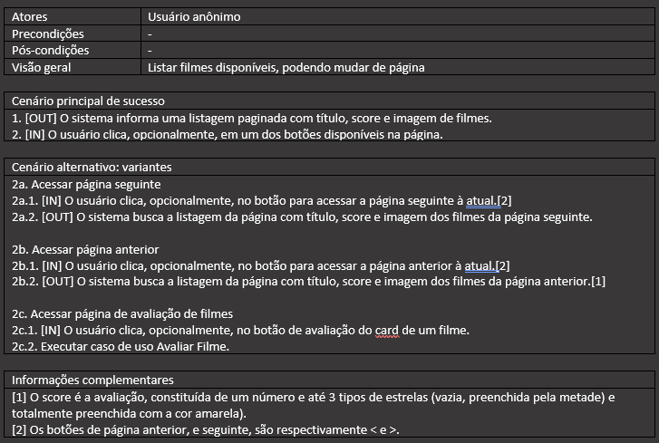
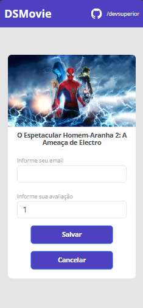
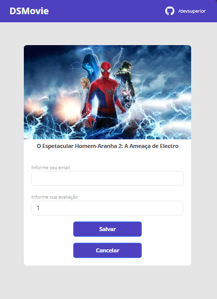
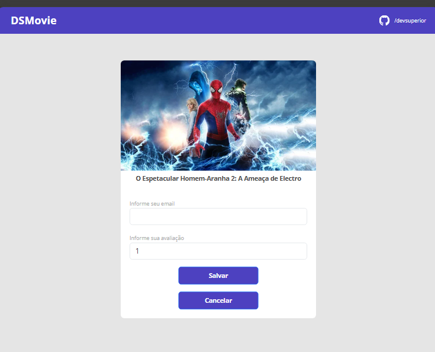
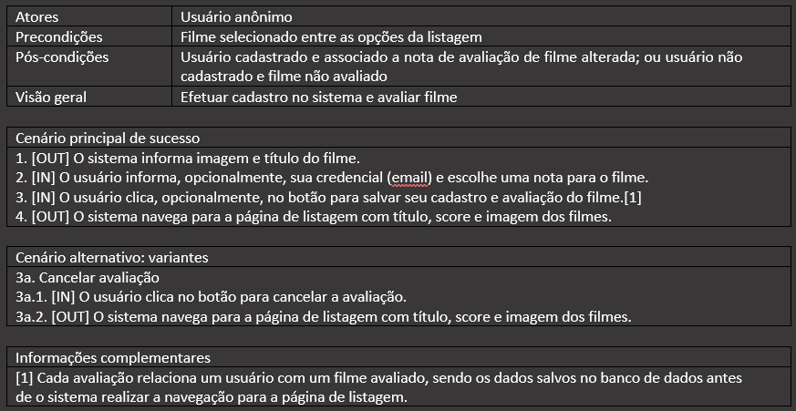

# DSMovie-Monorepo

## Resumo
Este projeto de aplicação web Full-Stack foi criado a partir de um evento gravado da DevSuperior (2022). A aplicação foi atualizada para versões mais recentes das tecnologias com o auxílio de inteligências artificiais (chatbots), que também foram utilizadas na criação dos casos de uso, bem como para orientar implantação tanto do projeto de Front-end (netlify) como o de Back-end (Railway).
A aplicação permite que os usuários avaliem filmes.

## Observações:
* Foram exercitados os perfis de test e dev para os testes locais, e prod para testes em nuvem.
* Para detalhes sobre implantação, ver os README dos projetos backend e frontend.
* O projeto exercitou o conceito de monorepo

## Stack
### Back-end
* Java
* Spring Boot

### Front-end
* React + Vite
* TypeScript
* Bootstrap

### Banco de Dados & Infraestrutura
* H2 (test)
* PostgreSQL + pgAdmin (dev)
* Docker (Ambiente de Banco de Dados)
* Node.js + Yarn (Ambiente de Desenvolvimento)

## Layout (Mobile-first)

### Página de listagem de filmes
width: 320px - 576px - 992px - 1200px

| | | |
| :-: | :-: | :-: |
|  |  |  |

#### Caso de uso: Listar filmes

### Página com formulário para avaliação de um filme
width: 320px - 576px - 992px - 1200px

| | | |
| :-: | :-: | :-: |
|  |  |  |

#### Caso de uso: Avaliar filme

### Layout modificado no cabeçalho da aplicação implantada em nuvem

No /Hf-DSMM foi incluído link para este repositório (para fins de demonstração e portifólio)
 

---
Gerson Klauck (Hfictus)