# Passo a passo para implantação de Front-end em nuvem, no Netlify.


## Criar conta em servidor.

Neste caso, foi criada conta no Netlify , onde foi hospedado o projeto frontend, contido na subpasta frontend do monorepo DSMovie-Monorepo.<br>

Criar uma conta no Netlify, com Github (provedor de Git que se use).<br>

Criar o arquivo netlify.toml na raiz do monorepo DSMovie-Monorepo.<br>

Acessar o site Netlify:<br>
* Se for o primeiro acesso, clicar no botão Log in with Github (para acessar com o Github).
* Se não se tiver uma conta, criar um perfil com dados pessoais (informar o perfil do projeto: por exemplo, projeto de estudos. E perfil: estudante).

Não sendo o primeiro acesso, pode-se dar sequência a partir daqui:<br>
Escolher o provedor de Git, onde o projeto está hospedado (Github, por exemplo). O projeto deve estar pronto para a implantação.
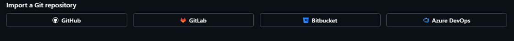

Pode ser necessário dar autorização do Github ao Netlify.<br>

Escolher o repositório (um específico, ou todos. Para ser instalado o app Netlify):
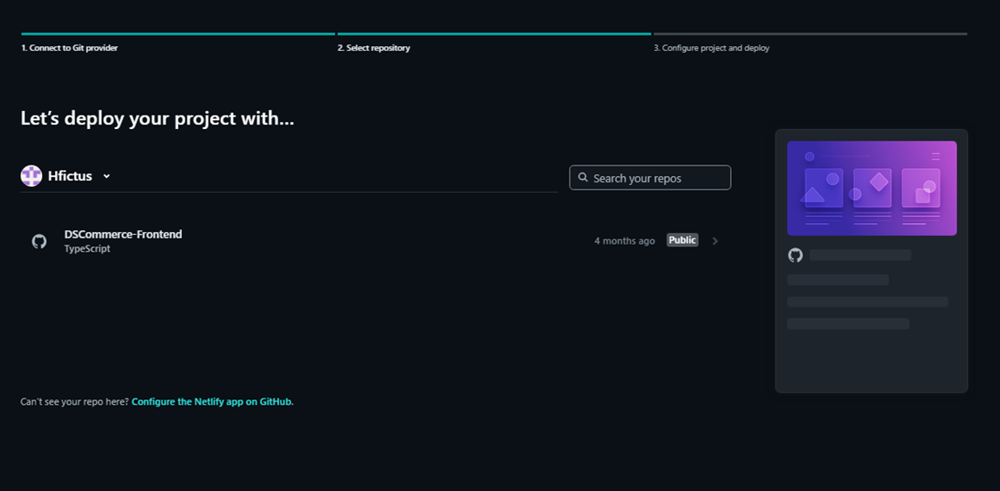
Na imagem acima aparece o DSCommerce-Frontend, implantado em outro momento.<br>

Procurando DSMovie-Monorepo, o repositório pode não ser encontrado, podendo aparecer uma informação sobre ser necessário fazer uma configuração de permissão:
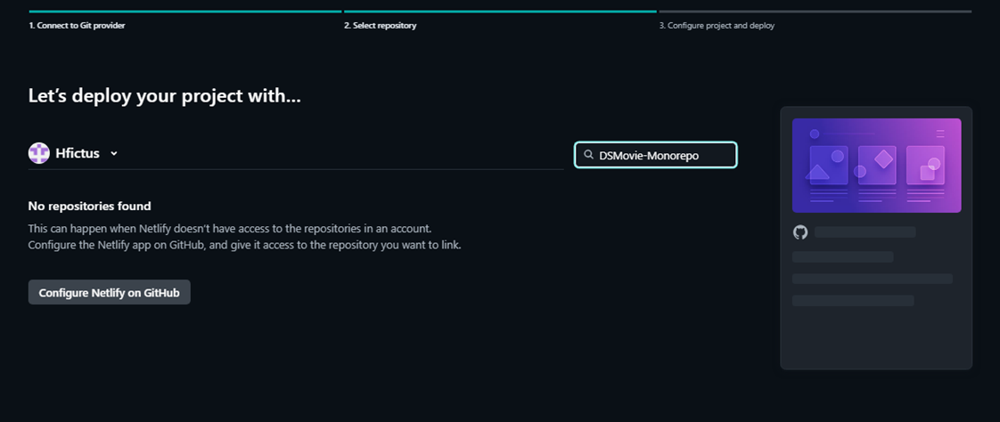
Na imagem acima, aparece o botão Configure Netlify on github, no qual se deve clicar para dar permissão de acesso do repositório DSMovie-Monorepo ao Netlify.<br> 
Se o Netlify exibir a mensagem "No repositories found" pode ser por ele ainda não ter permissão para enxergar ou acessar esse repositório específico (DSMovie-Monorepo).<br>

Uma nova janela do GitHub será aberta. Nela, será preciso autenticar (se solicitado) e rolar até a seção de Repository access (Acesso a repositórios):
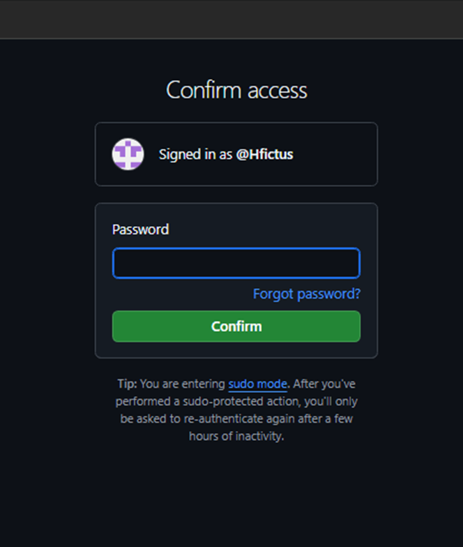

Rolar até a seção Repository access na janela que abrir:
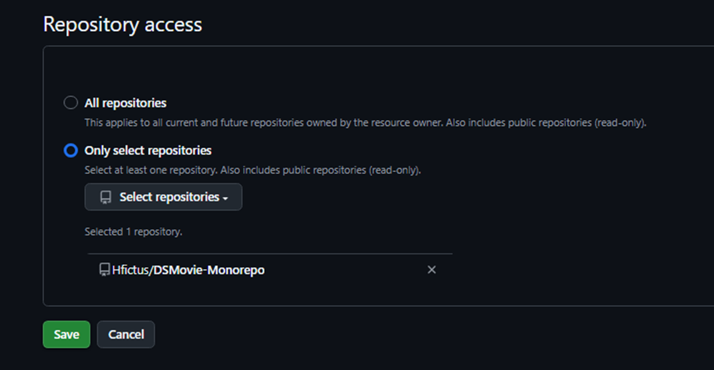
No trecho acima, há duas opções:
* All repositories: libera o acesso para todos os repositórios atuais existentes no Github e futuros (mais prático para quem está estudando).
* Only select repositories: Permite que se selecione manualmente apenas o repositório DSMovie-Monorepo (ou a sua estrutura de estudos).
Neste caso, foi selecionado o DSMovie-Monorepo no trecho acima, e deletado o DSCommerce-Bakend que havia sido autorizado a ser acessado em seu repositório pelo Netlify em outro momento. Em seguida, clicou-se em Save.
Depois de salvar, haverá um redirecionamento automático para a tela anterior do Netlify. O repositório passará a aparecer na busca e ele poderá ser selecionado para avançar para a última etapa, que é a 3. Configure project and deploy.<br>

Depois de salvar, haverá um redirecionamento automático para a tela anterior do Netlify. O repositório passará a aparecer na busca e ele poderá ser selecionado para avançar para a última etapa, que é a 3. Configure project and deploy.
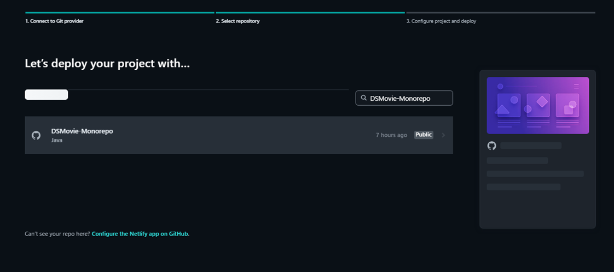
Clicando-se no repositório acima listado na etapa dois, há um direcionamento para a etapa três:
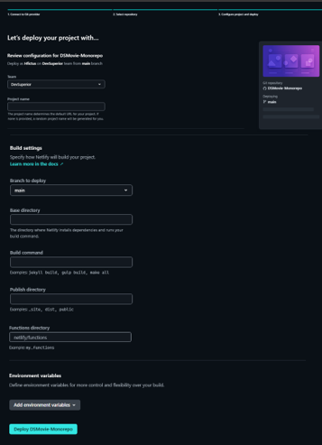

Explicação da configuração na etapa 3 acima (exemplo de formulário preenchido):<br>
Time:
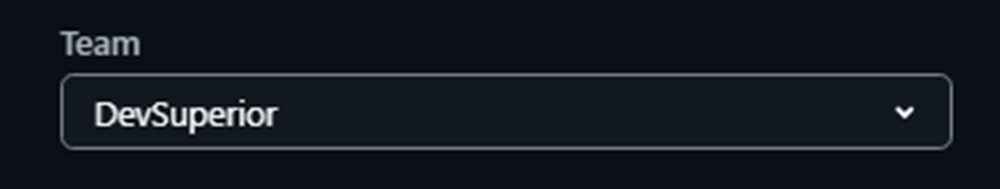


Nome do projeto (será usado na URL pública do site criado):
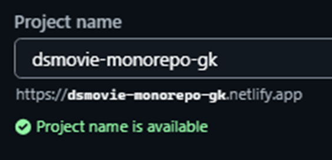

Branch do Github usada para o Deploy (a branch principal, main):
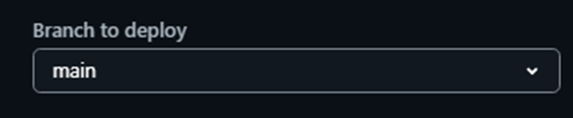

Diretório base, onde o Netlify instalará dependências e executará o comando de build (para monorepos):
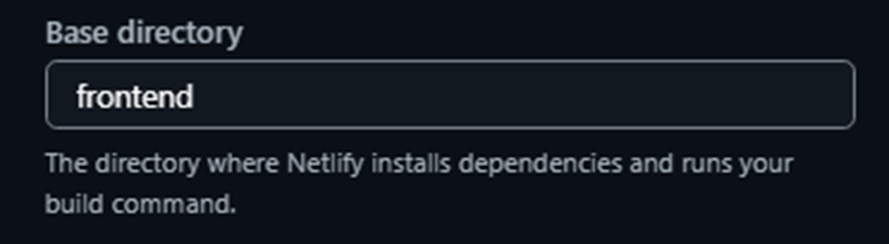
O diretório base deve ter o arquivo package.json e o vite.config.ts.<br>

Comando de build (para projeto com yarn):
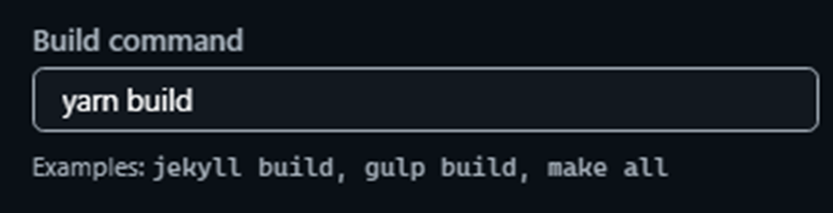

Diretório de publicação (projeto com Vite):
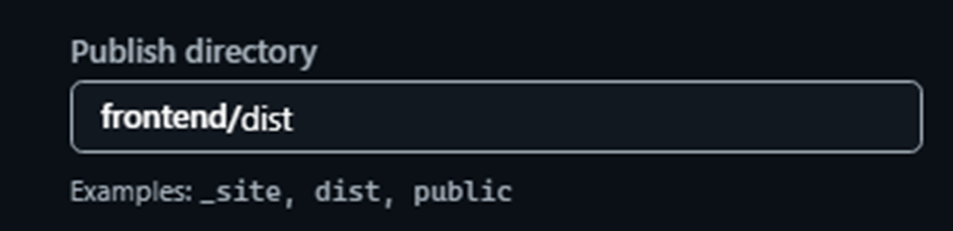

Se o projeto usa Vite, incluir: frontend/dist.<br>
Se o projeto usa React clássico (CRA), digitar: frontend/build<br>
Dica arquivo (netlify.toml):<br>
Como alternativa para não se precisar preencher isso na interface web toda vez (ou se se quiser deixar configurado direto no código), pode-se criar um arquivo chamado netlify.toml na raiz do repositório monorepo com o seguinte conteúdo:<br>
```
Ini, TOML
[build]
  base = "frontend/"
  publish = "frontend/dist/"
  command = "yarn build"
```
Se se optar pelo arquivo, o Netlify lerá essas configurações automaticamente assim que se avançar para a etapa 3.<br>
O arquivo netlify.toml na raiz do monorepo, faz com que as variáveis de Node e Yarn (NODE_VERSION e YARN_VERSION) sejam automaticamente injetadas durante o Build.<br> 

No formulário no Netlify, clicar em “Add enviroment variables” para criar a variável de ambiente
 VITE_BACKEND_URL.<br>
Selecionar opção para criar uma nova variável.<br>
Preencher os campos da seguinte forma:
* Key: VITE_BACKEND_URL
* Value: (URL de produção do Back-end, por exemplo, o link gerado pelo Railway onde o backend está rodando)
```
https://dsmovie-monorepo-production.up.railway.app
```

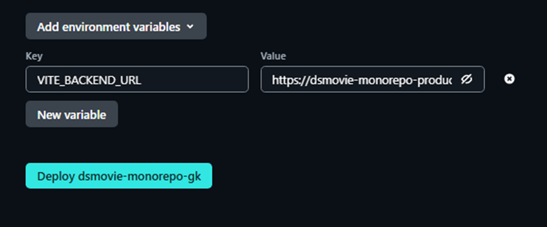


Clicar em Deploy dsmovie-monorepo-gk para fazer o Build e o Deploy do site.<br>
O processo de implantação (deploy) e compilação (build) de uma aplicação na plataforma Netlify é iniciado após execução. Durante essa etapa, o Netlify realiza o download do código-fonte a partir do repositório remoto integrado, interpreta as diretivas estruturadas no arquivo de configuração, instala as dependências necessárias e injeta as variáveis de ambiente parametrizadas. A compilação da interface, gerenciada por ferramentas como o Vite, é concluída em um intervalo estimado entre um e três minutos. Se o procedimento for finalizado sem erros, a plataforma altera o status da aplicação para publicado e disponibiliza a URL pública, permitindo o acesso à interface de usuário (à aplicação no navegador) e a comunicação integrada com o servidor de banco de dados e APIs em produção (neste caso, Railway).<br>
 Com isso o código do projeto frontend está preparado para ler uma variável chamada VITE_BACKEND_URL (caso ela exista) e, se ela não existir, ele usa o http://localhost:8080 (ambiente local), conforme é possível ver no código de requests.ts abaixo:
```
//Variável de ambiente customizada, para implantar no Netlify: VITE_BACKEND_URL

// Variável de ambiente customizada que será configurada no servidor para apontar para o Backend.
export const BASE_URL = import.meta.env.VITE_BACKEND_URL ?? "http://localhost:8080";
```

Link para a aplicação na nuvem criado neste projeto de estudos:
```
https://dsmovie-monorepo-gk.netlify.app/
```

Obs.: pode-se criar rapidamente um QR Code para acesso à aplicação:<br>
No Chrome, com a página da aplicação aberta, acessada pela URL acima, clicar no botão direito do mouse e buscar pela opção para criar QR Code para a página.


  


